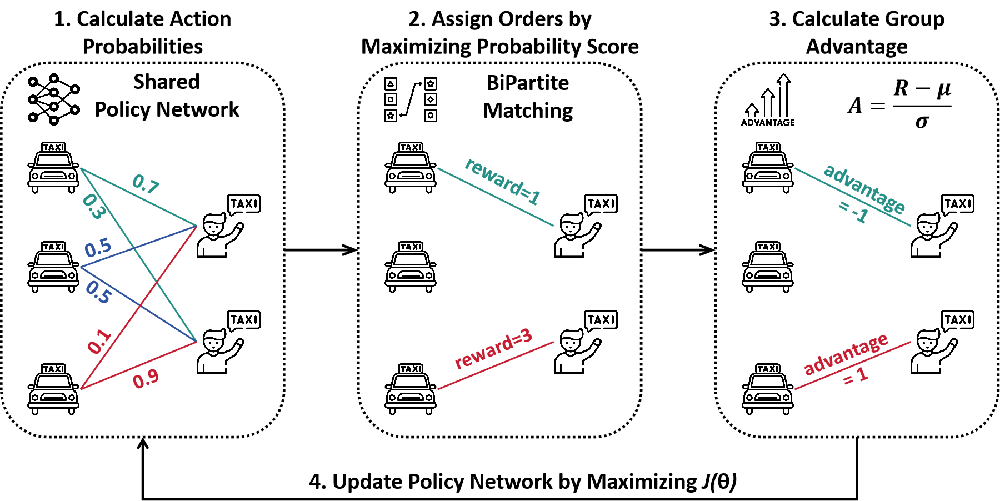

# OSPO: One Step Policy Optimization

<<<<<<< HEAD
**Article:** Zijian Zhao, Sen Li*, "One Step is Enough: A Highly Efficient Ride Sharing Framework via GRPO" (under review)
=======
**Article:** "One Step is Enough: Multi-Agent Reinforcement Learning based on One-Step Policy Optimization for Order Dispatch on Ride-Sharing Platforms" (under review)
>>>>>>> 7a274409919419daffeaaae0fa3137f9d1ec4cc1


# 1. Workflow




## 2. Simulator

The dataset used in this study is derived from the [yellow taxi data in Manhattan](https://www.nyc.gov/site/tlc/about/tlc-trip-record-data.page). The processed data can be found in the `./data` directory.

For route planning, we utilize the Open Source Routing Machine (OSRM). Specifically, we employ the US Northeast region for our experiments, with the OSRM file available for download at the [Geofabrik Download Server](https://download.geofabrik.de/north-america/us-northeast.html). To avoid conflicts with other programs on our device, we chose to use port 6000 instead of the default port 5000. Consequently, you can use the following command in Docker:

```dockerfile
docker run -t -i -p 6000:6000 -v "${PWD}:/data" ghcr.io/project-osrm/osrm-backend osrm-routed --algorithm mld /data/us-northeast-latest.osrm -p 6000
```


## 3. How to Run

```shell
python train.py
```

You can also set different parameters in the `process` function in `Worker.py` of `GRPO` to replicate the ablation study presented in our paper.


## 4. Parameters

The model parameters and training log files are located in the `./GRPO/parameters` and `./OSPO/parameters` directory.


## 5. Citation

```
@article{zhao2025one,
  title={One Step is Enough: Multi-Agent Reinforcement Learning based on One-Step Policy Optimization for Order Dispatch on Ride-Sharing Platforms},
  author={Zhao, Zijian and Li, Sen},
  journal={arXiv preprint arXiv:2507.15351},
  year={2025}
}
```

